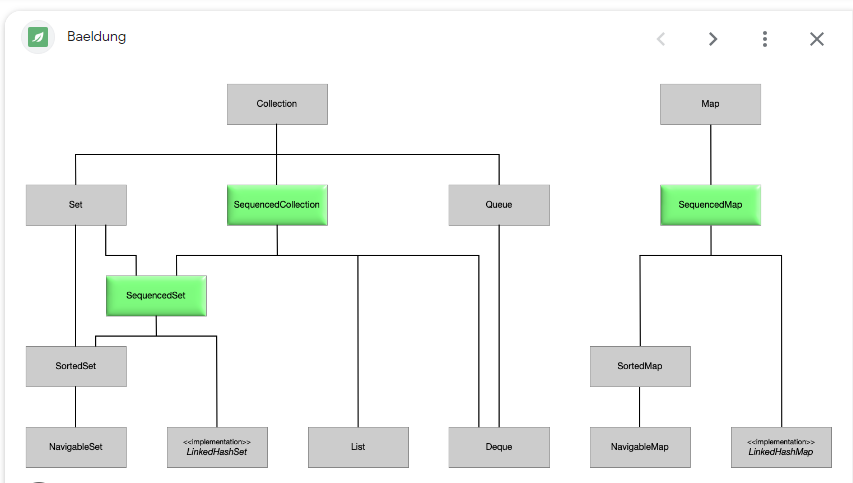
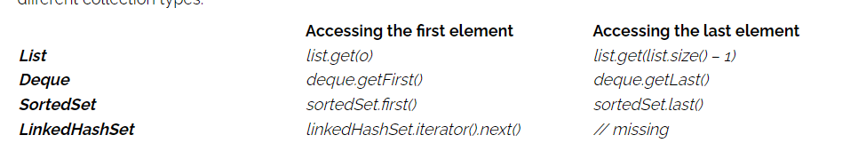
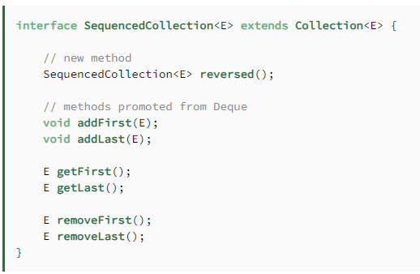

[Presentation](presentation1.pptx)

https://www.baeldung.com/java-21-sequenced-collections

1) Vector:

    Vector - это устаревший класс, предназначенный для хранения и управления динамическим массивом объектов.
    Этот класс является синхронизированным, что делает его подходящим для использования в многопоточных приложениях, 
    но это также может снижать производительность.
    Рекомендуется вместо Vector использовать более современные классы, такие как ArrayList, 
    который предоставляет похожую функциональность, но без синхронизации, что обычно более эффективно.

2) Properties:

    Properties - это класс, используемый для работы с настройками приложения в форме пар ключ-значение. 
    Этот класс обычно используется для чтения и записи конфигурационных файлов, таких как *.properties файлы.
    Он наследует Hashtable и предоставляет методы для загрузки и сохранения свойств из файлов.
   https://www.baeldung.com/java-properties

3) Stack:

    Stack - это класс, представляющий стек, который используется для реализации структуры данных "стек".
    Он наследует класс Vector и предоставляет методы для работы с элементами в порядке Last-In-First-Out (LIFO).

4) Dictionary:

    Dictionary - это абстрактный класс, предоставляющий интерфейс для хранения ключ-значение пар.
    Этот класс является устаревшим, и вместо него рекомендуется использовать интерфейс Map и его реализации, такие как HashMap.

5) Hashtable:

    Hashtable - это устаревший класс, который реализует хеш-таблицу для хранения ключ-значение пар.
    Он также синхронизирован, что делает его подходящим для использования в многопоточных приложениях, 
    но часто менее эффективным по сравнению с более современными альтернативами, такими как HashMap.
   
    - Синхронизация:

       Hashtable является синхронизированным, что означает, что операции над ним автоматически синхронизированы и потокобезопасны. 
       Это может быть полезно в многопоточных приложениях, но такая синхронизация может снижать производительность.
       HashMap не синхронизирован и не является потокобезопасным. Если необходима потокобезопасность при использовании HashMap, 
       то разработчик должен вручную предпринимать соответствующие меры синхронизации.
   
    - Null-значения:

       Hashtable не допускает null в качестве ключей или значений. Попытка добавить null приведет к выбросу исключения NullPointerException.
       HashMap позволяет использовать null как ключи и/или значения.
    
    - Перформанс:

       Из-за синхронизации Hashtable может быть менее производительным в однопоточных приложениях по сравнению с HashMap. 
       В современном Java, обычно рекомендуется предпочитать HashMap из-за его лучшей производительности.
    
    - Итераторы:

       Итераторы для Hashtable были добавлены позже в Java и не всегда поддерживаются в старых версиях Java.
       HashMap поддерживает итераторы и другие методы коллекций более надежно.
       Итак, в общем случае, если вам не требуется синхронизация, и вы можете обойтись без ограничения использования null, 
       то рекомендуется использовать HashMap из-за его более высокой производительности и более гибких возможностей. 
       В ситуациях, где вам необходима синхронизация, можно рассмотреть использование ConcurrentHashMap 
       или других потокобезопасных коллекций вместо Hashtable.

Обратите внимание, что в современном Java рекомендуется использовать более современные и эффективные структуры данных, 
такие как ArrayList, HashMap, и другие классы из Java Collections Framework.

https://www.baeldung.com/java-copy-on-write-arraylist

[O(n)](O_n.docx)

Equals

Java SE defines the contract that our implementation of the equals() method must fulfill. 
Most of the criteria are common sense. The equals() method must be:

- reflexive: an object must equal itself
- symmetric: x.equals(y) must return the same result as y.equals(x)
- transitive: if x.equals(y) and y.equals(z), then also x.equals(z)
- consistent: the value of equals() should change only if a property that is contained in equals() changes (no randomness allowed)

ctrl + shift + a -> Mouse: scroll