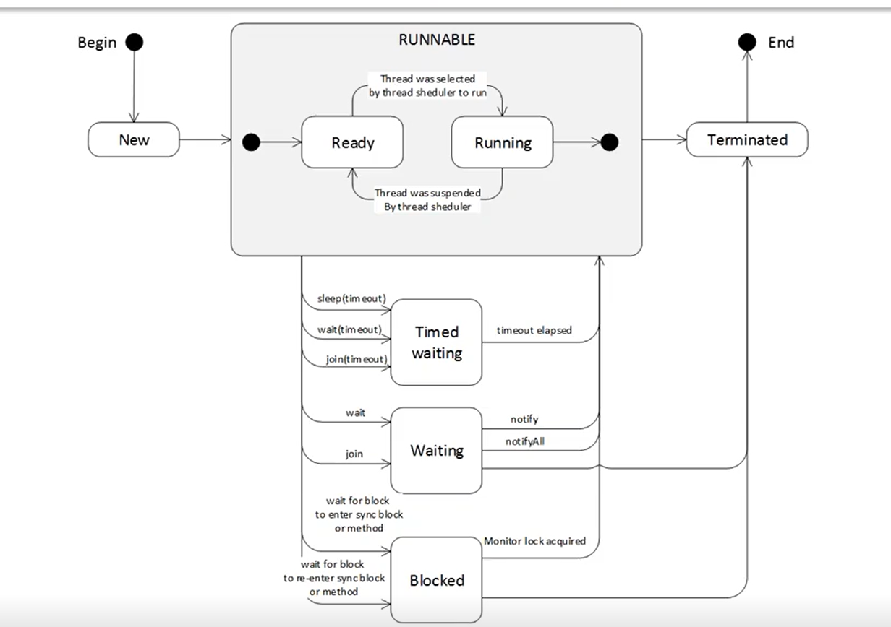
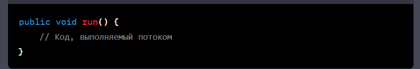
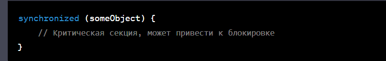
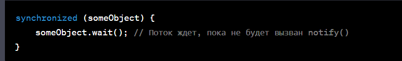
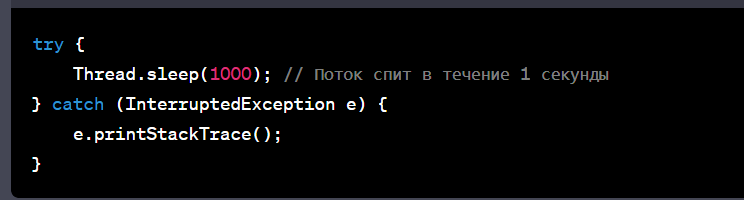
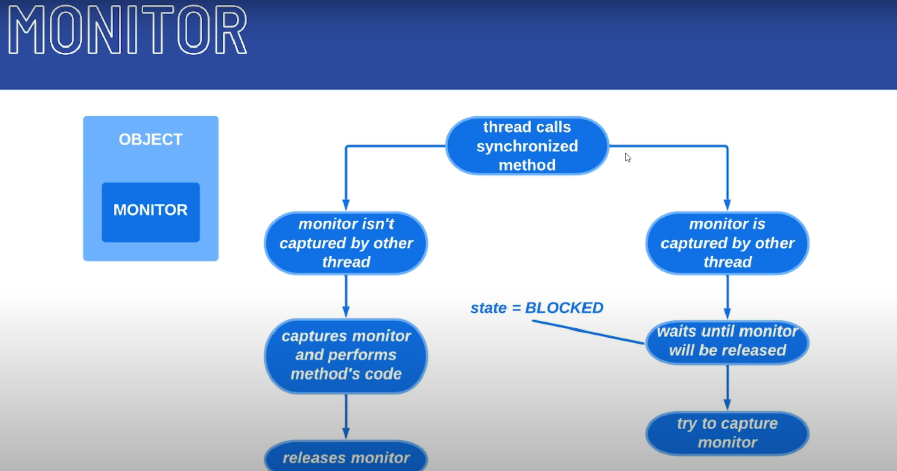

[Presentation](presentation.pptx)

Жизненный цикл потока в Java определяет стадии, через которые проходит поток, с момента его создания до завершения 
выполнения. В Java потоки управляются классом Thread. Вот основные стадии жизненного цикла потока:

1) Создание (New): В этой фазе поток создается, но еще не запущен. Вы можете создать поток, создав экземпляр 
    класса Thread или создать подкласс, реализующий интерфейс Runnable и использовать его экземпляр для создания потока.

2) Готовность (Runnable): После создания поток становится готовым к выполнению, но еще не начинает выполняться. 
    Когда поток готов, он может быть запущен.

3) Выполнение (Running): Поток входит в эту стадию, когда метод run() вызывается. Код, содержащийся в методе run(), 
    выполняется в этой фазе.

4) Блокировка (Blocked): Поток может перейти в состояние блокировки, например, если он ждет освобождения ресурса, 
    который занят другим потоком.

5) Ожидание (Waiting): Поток может войти в состояние ожидания по различным причинам, например, вызов метода wait() или sleep().

6) Синхронизация (Timed Waiting): Поток может находиться в состоянии синхронизации, например, 
    при вызове метода sleep() с указанием времени.

7) Завершение (Terminated): Поток завершает свое выполнение, когда метод run() завершается 
    или вызывается метод stop() (хотя последний метод считается устаревшим и не рекомендуется к использованию).

Эти стадии предоставляют основной механизм управления выполнением потоков в Java. Обратите внимание,
что важно правильно управлять потоками, чтобы избежать проблем с синхронизацией и безопасностью данных.

## Synchronizers

https://habr.com/ru/articles/277669/

https://gist.github.com/Jekins/2bf2d0638163f1294637

