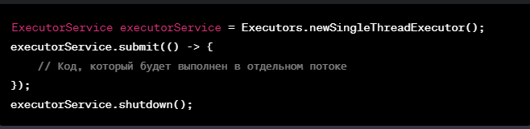
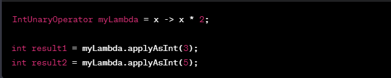
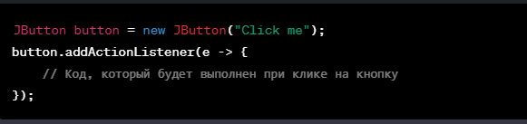
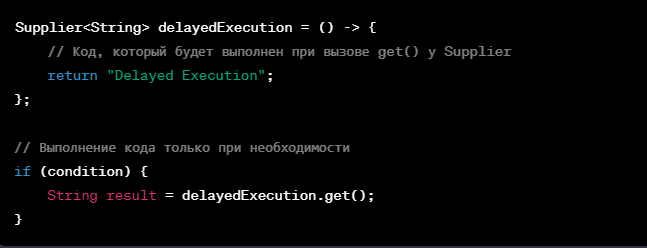

[Presentation](presentation.pptx)

[FunctionInterfaces](https://docs.oracle.com/javase/8/docs/api/java/util/function/package-summary.html)

[FunctionInterfaces examples](https://www.baeldung.com/java-8-functional-interfaces)

1) Выполнение кода в отдельном потоке:
    Используем ExecutorService для выполнения лямбда-выражения в отдельном потоке:

2) Выполнение одного и того же кода несколько раз:
   Простой пример, где лямбда-выражение умножает число на 2:

3) Выполнение кода в результате какого-то события:
   Пример использования лямбда-выражения для обработки события клика на кнопке:

4) Выполнение кода только в том случае, когда он действительно необходим:
   Использование Supplier для отложенного выполнения кода только при вызове метода get():

