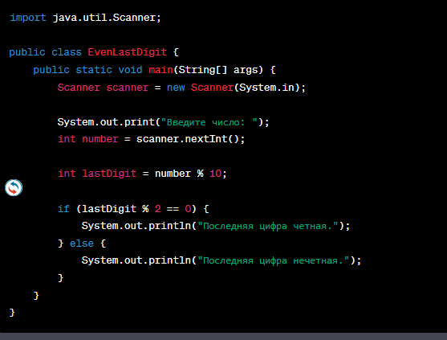
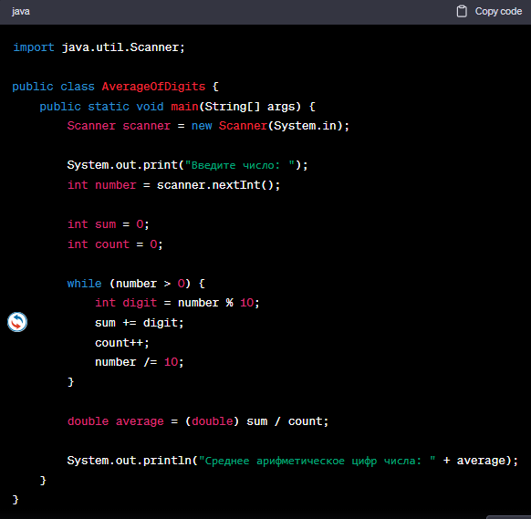
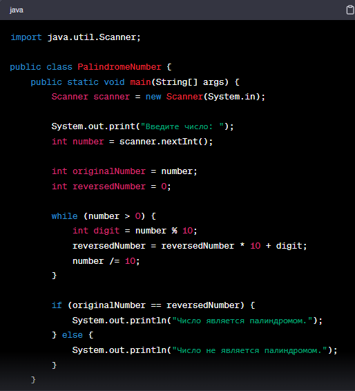
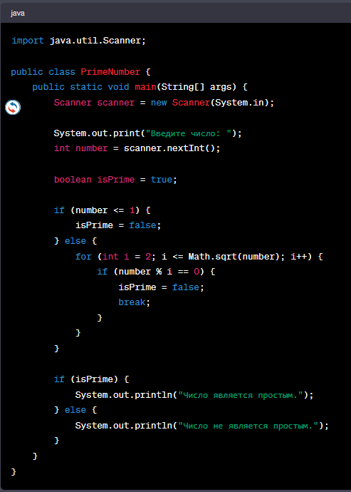
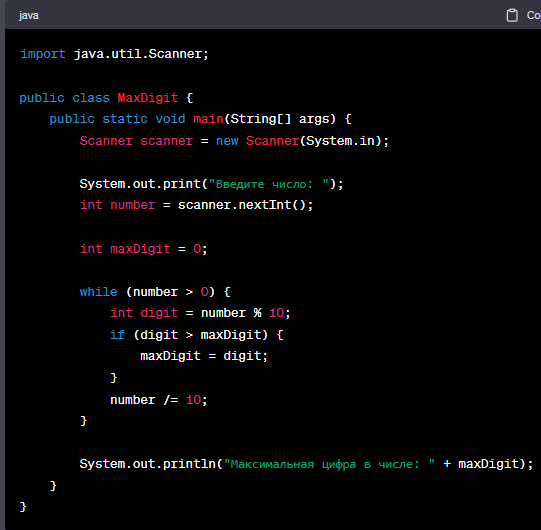
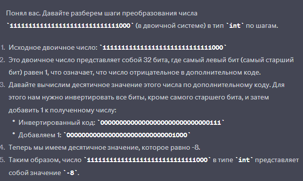

# Tasks

1) Вывести последнюю цифру числа
2) Найти сумму цифр ab + cd числа abcd
3) Вывести 3юю цифру 5ти-значного числа
4) Проверка на четность последней цифры:
5) Найти среднее арифметическое цифр числа:
6) Определить, является ли число палиндромом: 
7) Определить, является ли число простым: 
8) Поиск максимальной цифры в числе:
9) Сумма чисел: Напишите программу, которая суммирует два введенных пользователем числа и выводит результат.
10) Проверка на четность: Напишите программу, которая проверяет, является ли введенное число четным или нечетным.
11) Калькулятор: Создайте простой калькулятор, который выполняет операции сложения, вычитания, умножения и деления для двух чисел, введенных пользователем.
12) Максимальное число: Напишите программу, которая находит максимальное из трех введенных пользователем чисел.
13) Факториал: Реализуйте программу для вычисления факториала числа, введенного пользователем.
14) Палиндром: Проверьте, является ли введенная строка палиндромом (читается одинаково слева направо и справа налево).
15) Решение квадратного уравнения: Напишите программу для нахождения корней квадратного уравнения (вида ax^2 + bx + c = 0), где пользователь вводит значения a, b и c.
16) Простые числа: Напишите программу, которая определяет, является ли введенное пользователем число простым.
17) Таблица умножения: Выведите таблицу умножения для заданного числа, например, для числа 5.
18) Перевод температуры: Напишите программу, которая позволяет пользователю переводить температуру из градусов Цельсия в градусы Фаренгейта и наоборот.

```

```
