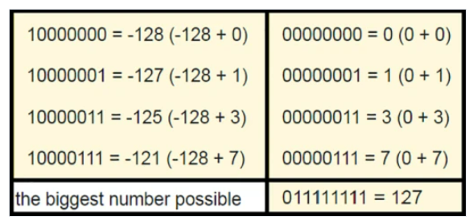

> примитивные типы java, хранят непосредственно значение байтов данных
> 
> ссылочный тип, хранит байты адреса объекта в Heap, то есть через эти переменные мы получаем доступ непосредственно к самому объекту

 
